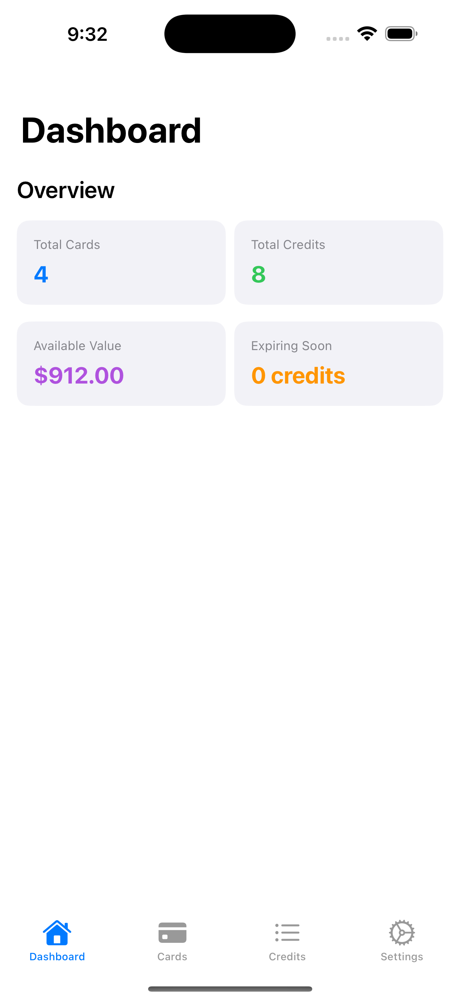
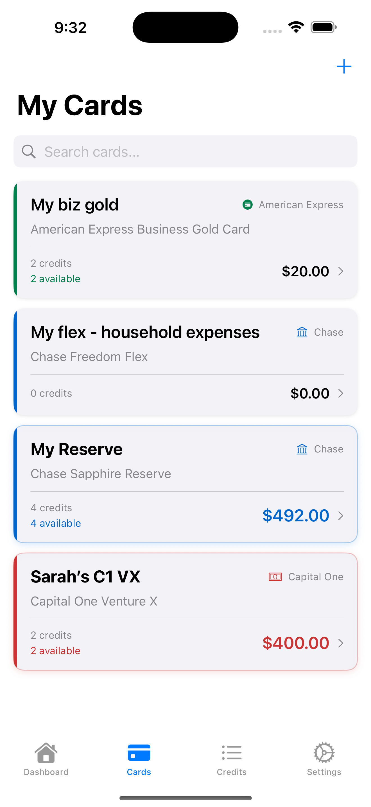
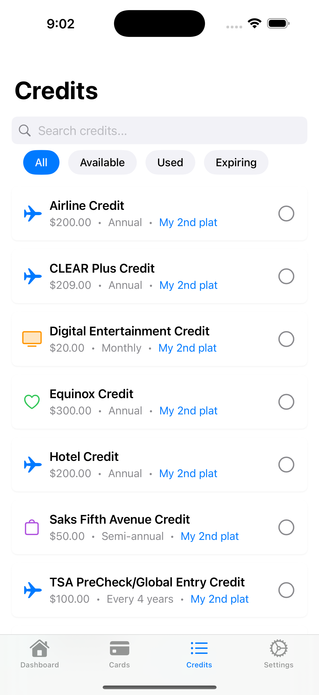
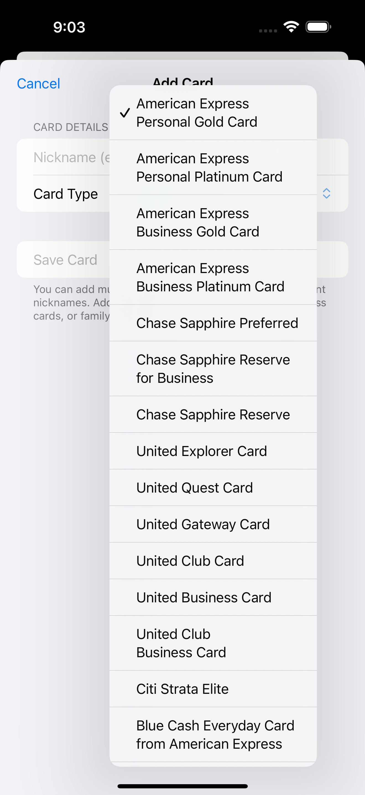

# MyCardBook

**Privacy-first iOS app for tracking credit card benefits**

[](https://apps.apple.com/app/mycardbook)
[](https://opensource.org/licenses/MIT)
[](https://developer.apple.com/ios/)
[](https://swift.org)

> Never lose a credit card benefit again. Track all your credit benefits in one beautiful, privacy-first app.

## ✨ Features

### 🔒 Privacy First
- **Local Storage Only** - All data stays on your device
- **No Tracking** - Zero analytics, no data collection  
- **No Account Required** - Start using immediately
- **Open Source** - Fully transparent and auditable

### 💳 Comprehensive Card Database
- **22 Popular Cards** - American Express, Chase, Citi, Capital One, and more
- **80+ Real Benefits** - Dining credits, travel allowances, streaming credits, and more
- **Always Updated** - Community-driven database with regular updates

### 📊 Smart Tracking
- **One-Tap Usage** - Mark credits as used instantly
- **Filter & Search** - Find credits by card, category, or status
- **Renewal Tracking** - Never miss expiration dates
- **Value Overview** - See total benefit value across all cards

### 🔄 Data Portability  
- **Export Anytime** - JSON and CSV export options
- **Import Support** - Restore from backups seamlessly
- **You Own Your Data** - Complete control and portability

## 📱 Screenshots

| Dashboard | Cards | Credits | Add Card |
|-----------|--------|---------|----------|
|  |  |  |  |

## 🚀 Getting Started

### Download
[](https://apps.apple.com/app/mycardbook)

### First Steps
1. **Download** MyCardBook from the App Store
2. **Add Your First Card** - Choose from our supported card list
3. **Give It a Nickname** - "My Gold Card", "Travel Card", etc.
4. **Start Tracking** - Mark benefits as used with a simple tap

## 💳 Supported Cards

### American Express
- **Personal Gold Card** (5 credits) - Dining, Uber, Resy, Dunkin', Hotel Collection
- **Personal Platinum Card** (9 credits) - Airline, Hotel, Uber, CLEAR, Saks, Entertainment, Equinox, Walmart+, TSA PreCheck
- **Business Gold Card** (3 credits) - Flexible Business, Walmart+, Hotel Collection
- **Business Platinum Card** (8 credits) - Airline, Dell, Indeed, CLEAR, Hilton, Wireless, TSA PreCheck
- **Blue Cash Everyday** (1 credit) - Disney Streaming
- **Blue Cash Preferred** (1 credit) - Disney Streaming

### Chase
- **Sapphire Preferred** (2 credits) - Hotel Credit, DashPass
- **Sapphire Reserve** (9 credits) - Edit Hotels, Travel Credit, Apple Services, StubHub, DoorDash, DashPass, Lyft, Peloton, Global Entry
- **Sapphire Reserve for Business** (8 credits) - Edit Hotels, Travel Credit, ZipRecruiter, Google Workspace, DoorDash, DashPass, Lyft, Gift Cards
- **United Explorer** (6 credits) - Instacart, United Hotels, Rideshare, JSX, Avis/Budget, Global Entry
- **United Quest** (4 credits) - Travel Credit, Instacart, Rideshare, Global Entry
- **United Gateway** (1 credit) - DashPass
- **United Club** (3 credits) - Renowned Hotels, Instacart, Rideshare
- **United Business** (2 credits) - Travel Credit, DashPass
- **United Club Business** (2 credits) - Renowned Hotels, FareLock

### Capital One
- **Venture X Personal** (5 credits) - Travel Credit, Anniversary Bonus, TSA PreCheck, Premier Hotels, Lifestyle Hotels
- **Venture X Business** (5 credits) - Travel Credit, Anniversary Bonus, TSA PreCheck, Premier Hotels, Lifestyle Hotels

### Citi
- **Strata Elite** (4 credits) - Hotel Benefit, Splurge Credit, Blacklane, Global Entry

*Don't see your card? [Request it here](https://github.com/pthakkar9/MyCardBook/issues)!*

## 🛠 Development

### Prerequisites
- Xcode 15.0+
- iOS 16.0+ deployment target
- Swift 5.9+

### Building Locally
```bash
git clone https://github.com/pthakkar9/MyCardBook.git
cd MyCardBook
open MyCardBook.xcodeproj
```

### Architecture
- **Framework**: SwiftUI + Combine
- **Architecture**: MVVM with Repository Pattern
- **Data**: Core Data for local persistence
- **Database**: JSON-based card benefit database

See [ARCHITECTURE.md](ARCHITECTURE.md) for detailed technical documentation.

### Contributing
We welcome contributions! See [CONTRIBUTING.md](CONTRIBUTING.md) for guidelines.

#### Quick Ways to Contribute
- **Add New Cards** - Submit card benefit data
- **Report Bugs** - Help us fix issues quickly
- **Suggest Features** - Tell us what you'd like to see
- **Improve Documentation** - Help others understand the project

## 🏗 Project Structure

```
MyCardBook/
├── MyCardBook/              # Main iOS app
│   ├── Views/              # SwiftUI views
│   ├── ViewModels/         # MVVM view models
│   ├── Models/             # Data models
│   ├── Services/           # Business logic
│   ├── Resources/          # Card database & assets
│   └── Design/            # Colors & styling
├── MyCardBookTests/        # Unit tests
├── MyCardBookUITests/      # UI tests
├── specs/                 # Product specifications
```

## 🔒 Privacy & Security

### Our Privacy Promise
- **No Data Collection** - We don't collect any personal information
- **Local Storage Only** - All data stays on your device
- **No Tracking** - Zero analytics or usage tracking
- **Open Source** - Complete transparency

Read our full [Privacy Policy](https://launchpadlogic.com/mycardbook/privacy).

### Security
- **Core Data Encryption** - Local data is encrypted
- **No Network Requests** - App works completely offline
- **Secure by Design** - Privacy-first architecture

## 📄 License

This project is licensed under the MIT License - see the [LICENSE](LICENSE) file for details.

## 🤝 Support

### Get Help
- **App Issues**: [Create an issue](https://github.com/pthakkar9/MyCardBook/issues)
- **General Support**: [Support Page](https://launchpadlogic.com/mycardbook/support)

### Community
- **GitHub Issues**: Bug reports and feature requests
- **Discussions**: Share ideas and ask questions
- **Contributing**: Help improve the app for everyone

## 🎯 Roadmap

### Current Version (1.0)
- ✅ Core benefit tracking
- ✅ 22 supported cards
- ✅ Export/import functionality
- ✅ Privacy-first design

### Coming Soon
- 🔄 Push notifications for expiring credits
- 🔄 Advanced analytics and insights
- 🔄 iPad-optimized design
- 🔄 More credit cards

## 📊 Stats

- **Cards Supported**: 22
- **Credits Tracked**: 80+
- **Code Coverage**: 85%+
- **App Size**: <10MB

---

**⭐ Star this repo if MyCardBook helps you track your credit card benefits!**
